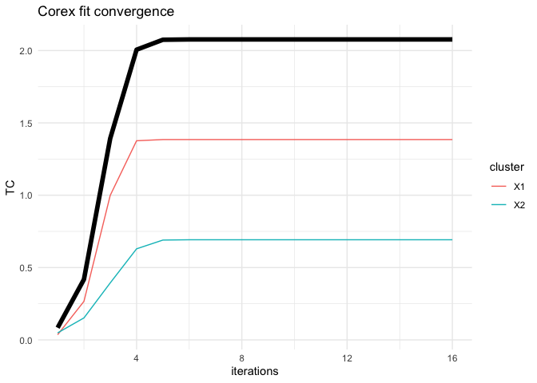

<!-- README.md is generated from README.Rmd. Please edit that file -->

# rcorex

Total correlation explanation is method for discovering latent structure
in high dimensional data. Total correlation explanation has been
implemented in Python as CorEx and related modules
(<https://github.com/gregversteeg/CorEx>). The initial aim of rcorex is
to implement Total Correlation Explanation in the R statistical
software, specifically to replicate the functionality of the Bio CorEx
Python module ( <https://github.com/gregversteeg/bio_corex> ) which is
designed to be suitable for biomedical datasets.

The theoretical framework behind the CorEx and Bio CorEx Python modules
are laid out in the following academic papers:  
1\. [Discovering Structure in High-Dimensional Data Through Correlation
Explanation](http://arxiv.org/abs/1406.1222)  
2\. [Maximally Informative Hierarchical Representions of
High-Dimensional Data](https://arxiv.org/abs/1410.7404)  
3\. [Comprehensive discovery of subsample gene expression components by
information explanation: therapeutic implications in
cancer](https://bmcmedgenomics.biomedcentral.com/articles/10.1186/s12920-017-0245-6)

## Installation

rcorex can be installed from Github:

``` r
# install.packages("remotes")
remotes::install_github("jpkrooney/rcorex")
```

## Minimal example

To fit a CorEx model in rcorex we can use the `biocorex()` command.
Biocorex accepts a data.frame or a matrix as input, however as with the
Python implementation of Bio CorEx, all variables must have the same
data-type and currently only “discrete” or “gaussian” data are allowed
as marginal descriptions, which apply to all columns.

``` r
library(rcorex)
# make a small dataset
df1 <- matrix(c(0,0,0,0,0,
             0,0,0,1,1,
             1,1,1,0,0,
             1,1,1,1,1), ncol=5, byrow = TRUE)

# fit biocorex
set.seed(1234)
fit1 <- biocorex(df1, n_hidden = 2, dim_hidden = 2, marginal_description = "discrete")
#> Calculating single iteration of corex
plot(fit1)
```



``` r

# What was the total correlation for each hidden dimension ?
fit1$tcs
#> [1] 1.3847955 0.6921477

# Which variables were clustered together?
fit1$clusters
#> [1] 0 0 0 1 1

# Which labels were assigned to each row of data for hidden cluster 1?
fit1$labels[, 1]
#> [1] 1 1 0 0

# And for hidden cluster 2?
fit1$labels[, 2]
#> [1] 0 1 0 1
```

## Hierarchical corex example

`rcorex` can search for hierarchical structure in data by using the
labels output from an `rcorex` object as the input to the next layer in
the hierarchy in the following example. Also note the use of the
`repeats = 5` argument to `biocorex`. The acts to run biocorex not once,
but 5 times and biocorex automatically selects the run which produces
the maximal TC to return to the user (unless the `return_all_runs`
argument is set to `TRUE`). In the network graph, edge thickness is
proportional to mutual information and node size represents mutual
multivariate information among children.

``` r
library(rcorex)
library(ggraph)
#> Loading required package: ggplot2

set.seed(1234)

# Load iris dataset
data("iris")

# Need to convert species factor variable to indicator variables
iris <- data.frame(iris , model.matrix(~iris$Species)[,2:3])
iris$Species <- NULL

# fit first layer of corex 
layer1 <- biocorex(iris, 3, 2, marginal_description = "gaussian", repeats = 5)
#>  Calculating repeat # 1
#>  Calculating repeat # 2
#>  Calculating repeat # 3
#>  Calculating repeat # 4
#>  Calculating repeat # 5
#> 5 out of 5 repeat runs of biocorex converged.
#> Returning biocorex with highest TC of all converged runs - unconverged runs will not be included in comparison of runs.

# Examine layer1 labels
head(layer1$labels)
#>      [,1] [,2] [,3]
#> [1,]    0    0    1
#> [2,]    0    0    1
#> [3,]    0    0    1
#> [4,]    0    0    1
#> [5,]    0    0    1
#> [6,]    0    0    1
```

We can then use the labels from `layer1` as the input for a second layer
of corex to discover hierarchical structure. Note that the value used
for n\_hidden should be lower in the second layer than it was in the
first.

``` r
# fit second layer of corex
layer2 <- biocorex(layer1$labels, 1,2, marginal_description = "discrete", repeats = 5)
#>  Calculating repeat # 1
#>  Calculating repeat # 2
#>  Calculating repeat # 3
#>  Calculating repeat # 4
#>  Calculating repeat # 5
#> 5 out of 5 repeat runs of biocorex converged.
#> Returning biocorex with highest TC of all converged runs - unconverged runs will not be included in comparison of runs.

# Examine layer1 labels
head(layer2$labels)
#>      [,1]
#> [1,]    0
#> [2,]    0
#> [3,]    0
#> [4,]    0
#> [5,]    0
#> [6,]    0
```
