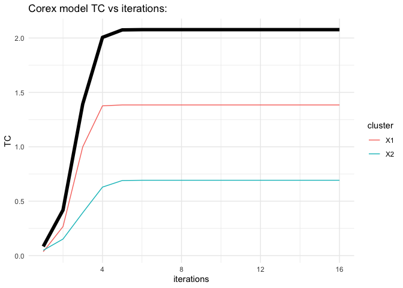

<!-- README.md is generated from README.Rmd. Please edit that file -->

# rcorex

<!-- badges: start -->

[](https://github.com/jpkrooney/rcorex/actions)
[](https://codecov.io/gh/jpkrooney/rcorex?branch=master)
<!-- badges: end -->

Total correlation explanation is method for discovering latent structure
in high dimensional data. Total correlation explanation has been
implemented in Python as CorEx and related modules
(<https://github.com/gregversteeg/CorEx>). The initial aim of rcorex is
to implement Total Correlation Explanation in the R statistical
software, specifically to replicate the functionality of the Bio CorEx
Python module ( <https://github.com/gregversteeg/bio_corex> ) which is
designed to be suitable for biomedical datasets. This is implemented in
the `biocorex()` command.

The theoretical framework behind the CorEx and Bio CorEx Python modules
are laid out in the following academic papers:  
1. [Discovering Structure in High-Dimensional Data Through Correlation
Explanation](http://arxiv.org/abs/1406.1222)  
2. [Maximally Informative Hierarchical Representions of High-Dimensional
Data](https://arxiv.org/abs/1410.7404)  
3. [Comprehensive discovery of subsample gene expression components by
information explanation: therapeutic implications in
cancer](https://bmcmedgenomics.biomedcentral.com/articles/10.1186/s12920-017-0245-6)

## Installation

rcorex can be installed from Github:

``` r
# install.packages("remotes")
remotes::install_github("jpkrooney/rcorex")
```

## Minimal example

To fit a CorEx model in rcorex we can use the `biocorex()` command.
`biocorex()` accepts a data.frame or a matrix as input, however as with
the Python implementation of Bio CorEx, all variables must have the same
data-type and currently only “discrete” or “gaussian” data are allowed
as marginal descriptions, which apply to all columns.

``` r
library(rcorex)
# make a small dataset
df1 <- matrix(c(0,0,0,0,0,
             0,0,0,1,1,
             1,1,1,0,0,
             1,1,1,1,1), ncol=5, byrow = TRUE)

# fit biocorex
set.seed(1234)
fit1 <- biocorex(df1, n_hidden = 2, dim_hidden = 2, marginal_description = "discrete", logpx_method = "pycorex")
#> Calculating single iteration of corex
plot(fit1)
```



``` r
summary(fit1)
#> rcorex model call: 
#> biocorex(data = df1, n_hidden = 2, dim_hidden = 2, marginal_description = "discrete", 
#>     logpx_method = "pycorex")
#> Data dimensions: 4 samples (rows) by 5 variables (columns).
#> Latent variable parameters: rcorex searched for 2 hidden variables with 2 possible states.
#> Model outcome state: Converged
#> Numer of iterations performed: 16
#> Total TCS at final iteration: 2.0769

# What was the total correlation for each hidden dimension ?
fit1$tcs
#> [1] 1.3847955 0.6921477

# Which variables were clustered together?
fit1$clusters
#> [1] 0 0 0 1 1

# Which labels were assigned to each row of data for hidden cluster 1?
fit1$labels[, 1]
#> [1] 1 1 0 0

# And for hidden cluster 2?
fit1$labels[, 2]
#> [1] 0 1 0 1
```
